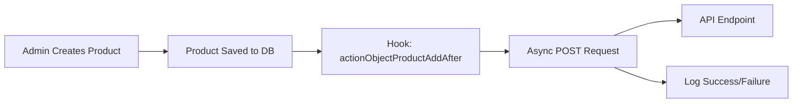
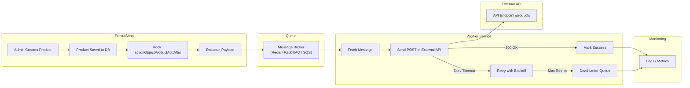

# Exercise 4 – Very Hard: Sync PrestaShop with External API

## Table of Contents

1. [Exercise Overview](#exercise-overview)
2. [Exercise Requirements](#exercise-requirements)
3. [Solution Overview](#solution-overview)
4. [How It Works](#how-it-works)
5. [Implementation Versions](#implementation-versions)
   * [Simple (Direct Hook)](#1-simple-direct-hook)
   * [Intermediate (Async HTTP)](#2-intermediate-async-http)
   * [Advanced (Hook & Worker)](#3-advanced-hook--worker)
6. [Architecture Diagrams](#architecture-diagrams)
7. [Setup Instructions](#setup-instructions)
8. [Local Demo Quickstart](#local-demo-quickstart)
9. [API Testing & Usage](#api-testing--usage)
10. [Error Handling & Optimization](#error-handling--optimization)
11. [Recommended Policies & Enhancements](#recommended-policies--enhancements)
12. [Performance & Failure Handling Comparison](#performance--failure-handling-comparison)
13. [Scalability & Production Considerations](#scalability--production-considerations)
14. [Additional Features to Consider](#additional-features-to-consider)

---

## Exercise Overview

**Goal:**
Build an event-driven synchronization between PrestaShop and an external API to send new product data automatically.

**Task:**
Whenever a new product is created in PrestaShop, send this JSON payload to an external API via a POST request:

```json
{
  "id": 123,
  "name": "Product name",
  "price": 49.90,
  "stock": 15
}
```

---

## Exercise Requirements

* Detect only **new product creation** events using `actionObjectProductAddAfter` hook.
* POST data asynchronously to external API over HTTPS.
* Non-blocking: Do not delay product creation page load or save operation.
* Gracefully handle errors, retries, and logging.
* Configurable API URL and auth token from module settings.
* Use idempotency keys to avoid duplicate processing.

---

## Solution Overview

We present **three implementation versions** based on complexity and scalability:

| Feature                 | Simple Version | Intermediate Async | Advanced Queue-Based |
| ----------------------- | -------------- | ------------------ | -------------------- |
| Uses PrestaShop hook    | ✅              | ✅                  | ✅                    |
| API call synchronous    | ✅              | ❌                  | ❌                    |
| Non-blocking HTTP       | ❌              | ✅                  | ❌                    |
| Message Queue for Async | ❌              | ❌                  | ✅                    |
| Automatic retries       | ❌              | Limited            | ✅                    |
| Dead Letter Queue (DLQ) | ❌              | ❌                  | ✅                    |
| Idempotency keys        | ❌              | ❌                  | ✅                    |
| Suitable for production | ❌ Small shops  | ⚠️ Medium load     | ✅ Large scale        |

---

## Implementation Versions

### 1. Simple (Direct Hook)

**Description:**
Sends the POST request synchronously from the PrestaShop hook. Easiest to implement but blocks product creation if the API is slow or fails.

```php
public function hookActionObjectProductAddAfter($params)
{
    $product = $params['object'];

    $payload = [
        'id'    => (int)$product->id,
        'name'  => $product->name[(int)Configuration::get('PS_LANG_DEFAULT')],
        'price' => (float)Product::getPriceStatic($product->id, true),
        'stock' => (int)StockAvailable::getQuantityAvailableByProduct($product->id)
    ];

    try {
        $response = (new \GuzzleHttp\Client())->post(
            Configuration::get('MY_API_URL'),
            [
                'headers' => [
                    'Authorization' => 'Bearer ' . Configuration::get('MY_API_TOKEN')
                ],
                'json' => $payload
            ]
        );
        PrestaShopLogger::addLog('Product sync success: ' . $response->getStatusCode());
    } catch (\Throwable $e) {
        PrestaShopLogger::addLog('Product sync failed: ' . $e->getMessage(), 3);
    }
}
```

---

### 2. Intermediate (Async HTTP)

**Description:**
Uses asynchronous HTTP requests (via Guzzle promises) so PrestaShop does not wait for the API response before completing the product creation. No queue required but limited retry logic.

```php
public function hookActionObjectProductAddAfter($params)
{
    $product = $params['object'];

    $payload = [
        'id'    => (int)$product->id,
        'name'  => $product->name[(int)Configuration::get('PS_LANG_DEFAULT')],
        'price' => (float)Product::getPriceStatic($product->id, true),
        'stock' => (int)StockAvailable::getQuantityAvailableByProduct($product->id)
    ];

    $client = new \GuzzleHttp\Client();
    $promise = $client->postAsync(
        Configuration::get('MY_API_URL'),
        [
            'headers' => [
                'Authorization' => 'Bearer ' . Configuration::get('MY_API_TOKEN')
            ],
            'json' => $payload
        ]
    );

    $promise->then(
        function ($res) {
            PrestaShopLogger::addLog('Async sync success: ' . $res->getStatusCode());
        },
        function ($e) {
            PrestaShopLogger::addLog('Async sync failed: ' . $e->getMessage(), 3);
        }
    );
}
```

---

### 3. Advanced (Hook & Worker)

**Description:**
Queues the product payload in a message broker for asynchronous processing by a separate worker script. Provides retries with exponential backoff, dead letter queue for failures, idempotency, and monitoring.

**Hook:**

```php
public function hookActionObjectProductAddAfter($params)
{
    $product = $params['object'];

    $payload = [
        'id'    => (int)$product->id,
        'name'  => $product->name[(int)Configuration::get('PS_LANG_DEFAULT')],
        'price' => (float)Product::getPriceStatic($product->id, true),
        'stock' => (int)StockAvailable::getQuantityAvailableByProduct($product->id)
    ];

    Queue::push([
        'payload'         => $payload,
        'idempotency_key' => 'product:' . $payload['id'] . ':' . time(),
        'created_at'      => gmdate('c')
    ]);
}
```

**Worker:**

```php
while ($message = Queue::pop()) {
    try {
        $response = $httpClient->post($config['api_url'], [
            'headers' => [
                'Authorization'   => 'Bearer ' . $config['api_token'],
                'Idempotency-Key' => $message['idempotency_key']
            ],
            'json' => $message['payload']
        ]);

        if ($response->getStatusCode() >= 400) {
            throw new \Exception('API error: ' . $response->getBody());
        }

        Queue::ack($message);
    } catch (\Throwable $e) {
        Queue::retryOrFail($message, $e->getMessage());
    }
}
```

---

## Setup Instructions

1. Create module folder `/modules/product_sync`.
2. Add main PHP file with chosen implementation.
3. Run `composer require guzzlehttp/guzzle` if using async HTTP or worker.
4. For Advanced version:

   * Setup message broker (Redis, RabbitMQ, AWS SQS, etc.).
   * Deploy worker script and schedule with cron or systemd service.
5. Configure API URL and token via PrestaShop admin module settings.

---

## API Testing & Usage

Example HTTP request sent to external API:

```http
POST https://external-api.example.com/products
Authorization: Bearer MY_API_TOKEN
Idempotency-Key: product:123:1691507200
Content-Type: application/json

{
  "id": 123,
  "name": "Product name",
  "price": 49.90,
  "stock": 15
}
```

---

## Error Handling & Optimization

| Version      | Error Handling                   | Retry Mechanism                | Logging                         |
| ------------ | -------------------------------- | ------------------------------ | ------------------------------- |
| Simple       | Logs errors only                 | No                             | Basic (PrestaShop logs)         |
| Intermediate | Logs errors asynchronously       | No (manual retry required)     | Basic + async success/fail logs |
| Advanced     | Retries with exponential backoff | Yes, automatic up to max tries | Full logs + monitoring          |

---

## Performance & Failure Handling Comparison

| Metric                      | Simple (Sync)                     | Intermediate (Async HTTP)       | Advanced (Queue & Worker)         |
| --------------------------- | --------------------------------- | ------------------------------- | --------------------------------- |
| Impact on product creation  | Blocks request until API responds | Immediate return, HTTP async    | Immediate return, queue push only |
| Scalability                 | Low (blocks, no retries)          | Medium (non-blocking, no queue) | High (scalable workers & retries) |
| Error recovery              | Manual                            | Manual                          | Automatic with DLQ & alerts       |
| Complexity                  | Low                               | Medium                          | High                              |
| Infrastructure requirements | None                              | None (just PHP async HTTP lib)  | Message broker + worker process   |

---

## Scalability & Production Considerations

| Feature      | Recommendation                                                      |
| ------------ | ------------------------------------------------------------------- |
| Queue System | Redis Streams, RabbitMQ, AWS SQS, or Kafka for high throughput.     |
| Workers      | Horizontally scale multiple workers.                                |
| Batching     | Batch multiple products in one API call if supported.               |
| Monitoring   | Integrate Prometheus/Grafana for queue length, failures, latency.   |
| Security     | Use HTTPS, API keys, HMAC signatures, and minimal privilege tokens. |
| Backpressure | Throttle workers to respect API rate limits.                        |
| Idempotency  | Store idempotency keys for 30+ days to prevent duplicates.          |
| Recovery     | Admin UI to review and manually retry failed items from DLQ.        |

---

## Architecture Diagrams

### Simple Version


### Intermediate Async HTTP Version



### Advanced Queue-Based Version



---

## How It Works

1. **PrestaShop** detects product creation via the hook `actionObjectProductAddAfter`.
2. Depending on implementation:

   * Simple: Sends POST synchronously.
   * Intermediate: Sends POST asynchronously (non-blocking HTTP).
   * Advanced: Queues payload for async worker processing.
3. Worker processes queued messages, sends to external API, and retries on failure.
4. Failures beyond max retries go to Dead Letter Queue (DLQ) for admin review.
5. Logs and metrics collected for monitoring and alerting.

---

## Additional Features to Consider

* **Admin UI Dashboard:** For viewing sync status, retrying failed jobs, and configuring settings.
* **Webhook Listener:** To sync external API updates back into PrestaShop.
* **Batch Processing:** Group product updates to reduce API calls and improve throughput.
* **Rate Limiting & Backoff:** To prevent hammering external API during high load.
* **Security Enhancements:** Encrypt stored API tokens, use OAuth or JWT if supported.
* **Localization:** Support multiple languages in product names and descriptions.
* **Testing:** Unit and integration tests to verify hook and worker behaviors.
* **Metrics Export:** Expose Prometheus metrics or logs for external monitoring tools.
* **Graceful Shutdown:** For worker processes to avoid message loss during restarts.

---

## Local Demo Quickstart

These demos require only PHP with the cURL extension. No DB or PrestaShop needed.

- Windows PowerShell is assumed below. For macOS/Linux, use the second command shown for each case.

### Prerequisites
- PHP 8+ installed and available on PATH
- cURL extension enabled (default in most PHP distributions)

### 1) Simple (Synchronous)
- Windows:
  ```powershell
  php .\exercise-4-prestashop-sync-external-api\simple-version\product_sync_simple.php
  ```
- macOS/Linux:
  ```bash
  php ./exercise-4-prestashop-sync-external-api/simple-version/product_sync_simple.php
  ```
- Output: console + `exercise-4-prestashop-sync-external-api/simple-version/simple.log`

### 2) Intermediate (Async HTTP)
- Windows:
  ```powershell
  php .\exercise-4-prestashop-sync-external-api\intermediate-version\product_sync_async.php
  ```
- macOS/Linux:
  ```bash
  php ./exercise-4-prestashop-sync-external-api/intermediate-version/product_sync_async.php
  ```
- Output: console + `exercise-4-prestashop-sync-external-api/intermediate-version/async.log`

### 3) Advanced (Queue + Worker)
1) Enqueue a demo message
   - Windows:
     ```powershell
     php .\exercise-4-prestashop-sync-external-api\advanced-version\product_sync_advanced.php produce
     ```
   - macOS/Linux:
     ```bash
     php ./exercise-4-prestashop-sync-external-api/advanced-version/product_sync_advanced.php produce
     ```
2) Start the worker (processes queue, handles retries, DLQ)
   - Windows:
     ```powershell
     php .\exercise-4-prestashop-sync-external-api\advanced-version\product_sync_advanced.php work
     ```
   - macOS/Linux:
     ```bash
     php ./exercise-4-prestashop-sync-external-api/advanced-version/product_sync_advanced.php work
     ```
- Output: console + `exercise-4-prestashop-sync-external-api/advanced-version/advanced.log`
- Folders created automatically:
  - `advanced-version/queue/` (pending)
  - `advanced-version/work/` (in-flight)
  - `advanced-version/dlq/` (failures after max retries)

### Configuration
- Each demo defines constants at the top for API URL and token (defaults to `https://httpbin.org/post` and `TEST_TOKEN`).
- Edit these if you want to point to another endpoint:
  - Simple: `SIMPLE_API_URL`, `SIMPLE_API_TOKEN`
  - Intermediate: `ASYNC_API_URL`, `ASYNC_API_TOKEN`
  - Advanced: `ADV_API_URL`, `ADV_API_TOKEN`

### What to Expect
- Simple: the script waits for HTTP to complete before exiting.
- Intermediate: minimal waiting; logs indicate async completion.
- Advanced: producer enqueues; worker processes, retries with backoff, sends to DLQ after max retries.

---

## Recommended Policies & Enhancements

### Retry & Timeout Policy
- Timeouts: 5–10s connect/read timeouts for HTTP calls.
- Retryable conditions: network errors, HTTP 408, 429, and 5xx.
- Max retries: 3–5 attempts with exponential backoff and jitter (e.g., 1s, 2s, 4s + 0–250ms jitter).
- Circuit breaker: temporarily stop attempts if error rate exceeds threshold; resume after cool-off.
- Respect `Retry-After` header on 429/503 when present.

### Idempotency
- Send an `Idempotency-Key` header: `product:{id}:{timestamp or hash}`.
- External API should store keys at least 30 days to deduplicate retried requests.
- Ensure server-side logic treats repeated keys as safe replays (same response or 409/200).

### Security Measures
- Transport: HTTPS only.
- Auth: Bearer tokens or HMAC signatures (include date, body hash) with short-lived tokens or key rotation.
- Least privilege: Token scope limited to product ingest; rotate regularly.
- Storage: In PrestaShop, store credentials in `Configuration` with encryption at rest.
- Network: Optional IP allowlisting and WAF rules for the API endpoint.

### Rate Limiting & Backpressure
- Handle 429: backoff with jitter, parse `Retry-After`, slow down workers.
- Backpressure: cap concurrent workers and queue depth; apply dynamic throttling.
- Batching: if supported, batch multiple products per request to reduce overhead.

### Data Validation & Localization
- Validate/sanitize: ensure `id` is int, `price` numeric, `stock` non-negative.
- Localization: choose language for `name` explicitly (default or shop language) and document fallback.
- Schema versioning: include a `version` field in payload for evolvability.

### Configuration Mapping (Real Module)
- Expose settings in module config UI mapped to `Configuration` keys:
  - `MY_API_URL`, `MY_API_TOKEN`, retry count, backoff, timeout, enable batching.
- Mask sensitive fields in UI; add test button to validate connectivity.

### Observability
- Logging: structured logs including product id, status code, latency, attempt, idempotency key.
- Metrics: counters (success/failure), histograms (latency), gauges (queue length), DLQ size.
- Alerts: on sustained failures, DLQ growth, or high latency.

